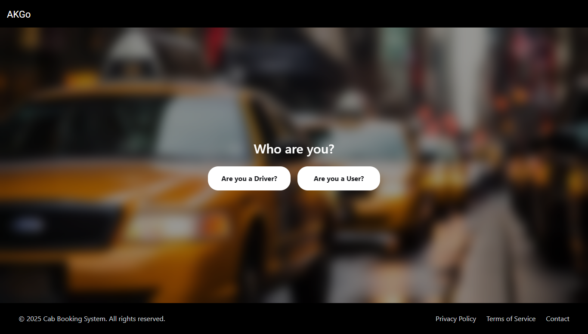
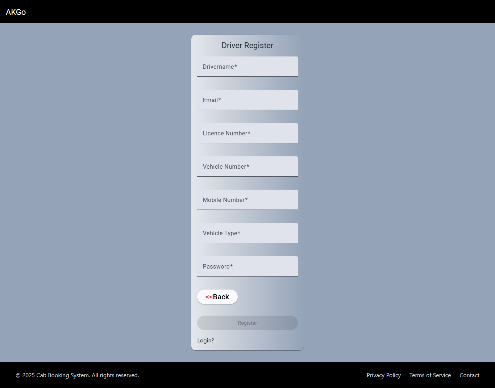
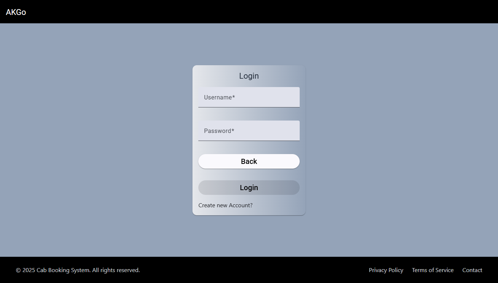
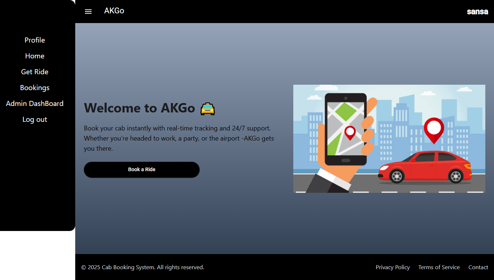
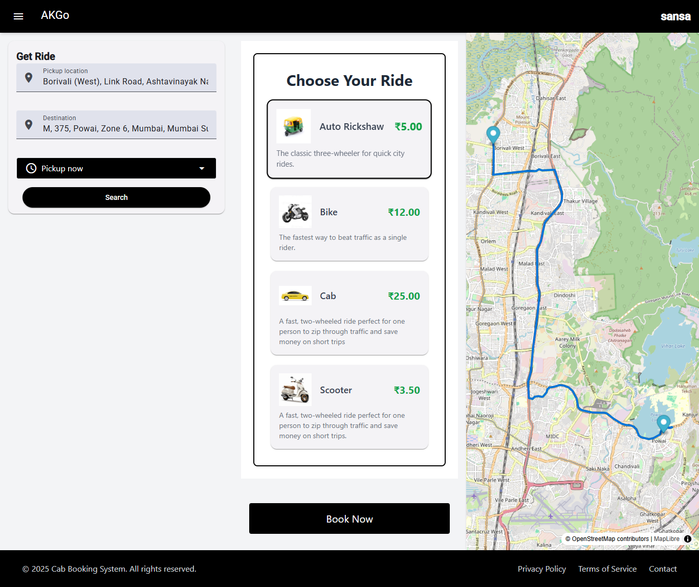
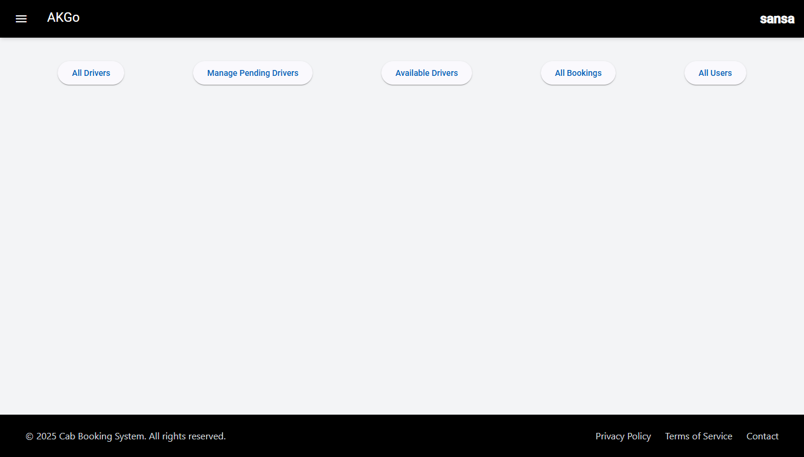
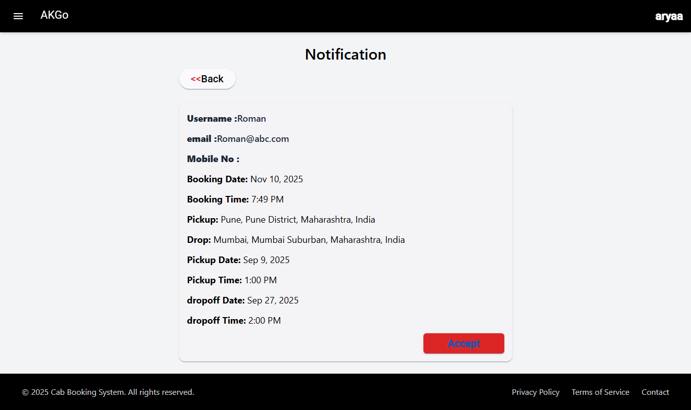
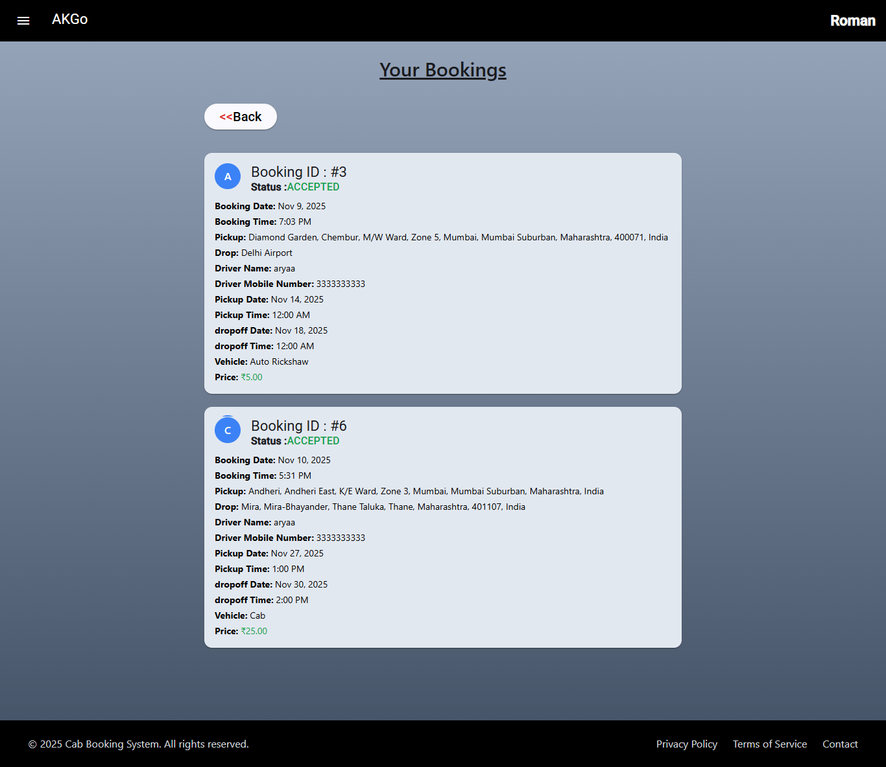

<h1>[Online Cab Booking System]</h1>

<h2>Overview</h2>
The Online Cab Booking System is a full-stack web application that allows users to book cabs online securely and efficiently.
It includes separate modules for users, drivers, and admins.
The project is developed using Angular for the frontend and Spring Boot for the backend, with JWT authentication, BCrypt encryption, and WebSocket for live driver booking notifications.
MapLibre is used for map display, and OpenStreet API provides location autocomplete functionality.

---

<h1>Technology Stack</h1>

<h2>Frontend</h2>

<ul>
 <li><Strong>Angular 17+ : </Strong><ul><li>Frontend framework</li></ul></li>

<li><Strong>Angular Material :  </Strong><ul><li> UI components</li></ul></li>

<li><Strong>Tailwind CSS : </Strong><ul><li> Responsive and modern styling</li></ul></li>

<li><Strong>HTTP Interceptor : </Strong><ul><li> Attaches JWT token to HTTP requests</li></ul></li>

<li><Strong>Reactive Forms Module :</Strong><ul><li> Form validation and handling</li></ul></li>

<li><Strong>AuthGuard : </Strong><ul><li> Protects restricted routes</li></ul></li>

<li><Strong>MapLibre : </Strong><ul><li> Displays pickup and drop locations</li></ul></li>

<li><Strong>OpenStreet API : </Strong><ul><li> Location autocomplete</li></ul></li>
</ul>

<h2>Backend</h2>

<ul>
<li><Strong>Spring Boot (Java 17+) : </Strong><ul><li> Backend REST API development</li></ul></li>

<li><Strong>Spring Data JPA (Hibernate) : </Strong><ul><li> ORM for database communication</li></ul></li>

<li><Strong>MySQL : </Strong><ul><li> Stores user, driver, and booking information</li></ul></li>

<li><Strong>WebSocket : </Strong><ul><li> Used for live driver booking notifications</li></ul></li>
</ul>

<h2>Security</h2>

<ul>
<li><Strong>Spring Security : </Strong><ul><li> Authentication and authorization</li></ul></li>

<li><Strong>JWT (JSON Web Token) : </Strong><ul><li> Token-based authentication</li></ul></li>

<li><Strong>BCrypt : </Strong><ul><li> Password encryption for secure login</li></ul></li>

<li><Strong>AuthGuard (Frontend) : </Strong><ul><li> Prevents unauthorized access</li></ul></li>
</ul>

---------------------

<h2>Screenshots</h2>

<table>
<tr>
  <td style="border: 1px solid; padding:10px;" align="center">
    
    
<b>Start-Page</b>

  </td>
  <td style="border: 1px solid; padding:10px;" align="center">
     
    
<b>Driver-RegisterPage</b>

  </td>
  <td style="border: 1px solid; padding:10px;" align="center">
     
    
<b>User-LoginPage</b>

  </td>
</tr>
<tr>
  <td style="border: 1px solid; padding:10px;" align="center">
    
    
<b>User-Homepage</b>

  </td>
  <td style="border: 1px solid; padding:10px;" align="center">
     
    
<b>GetRidePage</b>

  </td>
  <td style="border: 1px solid; padding:10px;" align="center">
     
    
<b>Driver-PendingHomePage</b>

  </td>
</tr>
<tr>
  <td style="border: 1px solid; padding:10px; " align="center">
    
    
<b>Admin-DashBoard</b>

  </td>
  <td style="border: 1px solid; padding:10px;" align="center">
     
    
<b>Driver-NotificationPage</b>

  </td>
  <td style="border: 1px solid; padding:10px;" align="center">
     
    
<b>User-BookingHistory Page</b>

  </td>
</tr>
</table>
 

 

-
